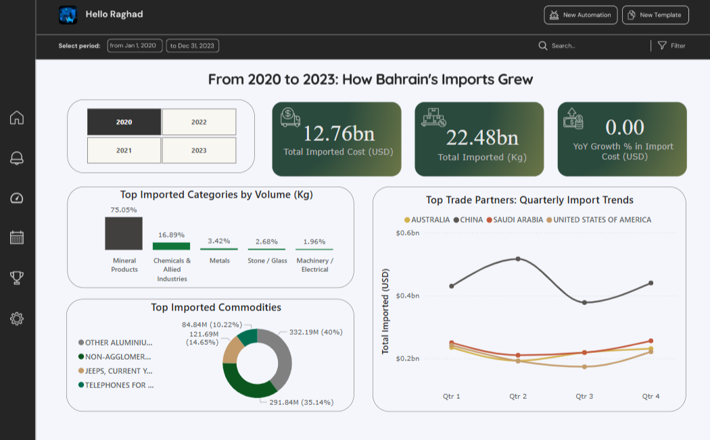
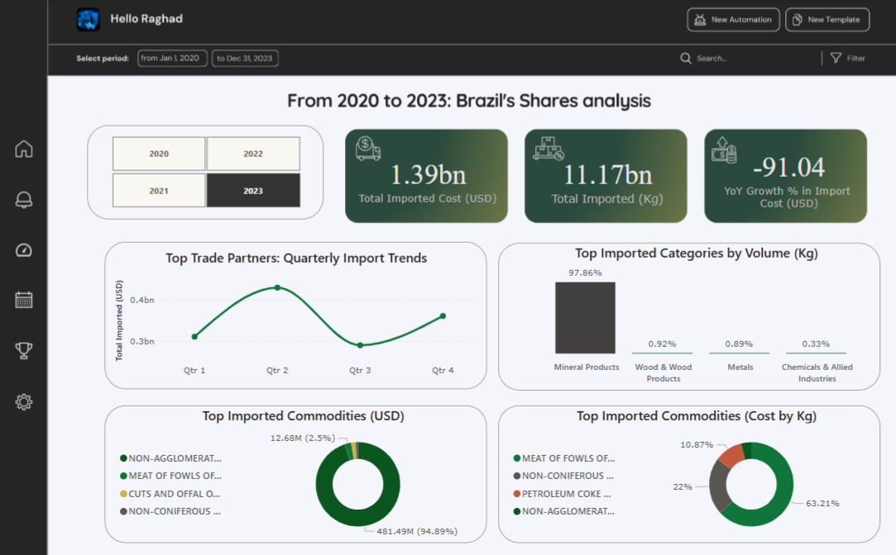

# 📊 A Power BI Dashboard Analyzing Bahrain’s Import Trends (2020–2023)  

## Overview  
This repository contains a Power BI dashboard that provides insights into Bahrain’s import trends from 2020 to 2023. It visualizes key trade patterns, top commodities, and major importing countries.  

## Data Source & Data Cleaning  
The data were collected from:  
[Data.gov.bh](https://www.data.gov.bh/explore/?disjunctive.theme&sort=modified&q=import)  
Four years of Bahrain's import data were combined into a single dataset (2020-2023), cleaned and analyzed accordingly.  

## Key Insights  
1. 📈 **Total Import Growth** – Year-over-year analysis  
2. 🌎 **Top Importing Countries** – Quarterly trends & trade partners  
3. 🏗 **Key Imported Commodities & Categories**  
4. 💰 **Import Value & Weight Breakdown**  

# Metrics

# Brazil Imports shares

# Summary
1. Bahrain’s total import cost (USD) has been increasing over the years, while YoY growth percentage shows fluctuations.
2. Mineral products consistently account for the majority of total imports by weight (Kg).
3. Key commodities like aluminum, gold, and machinery remain significant.
