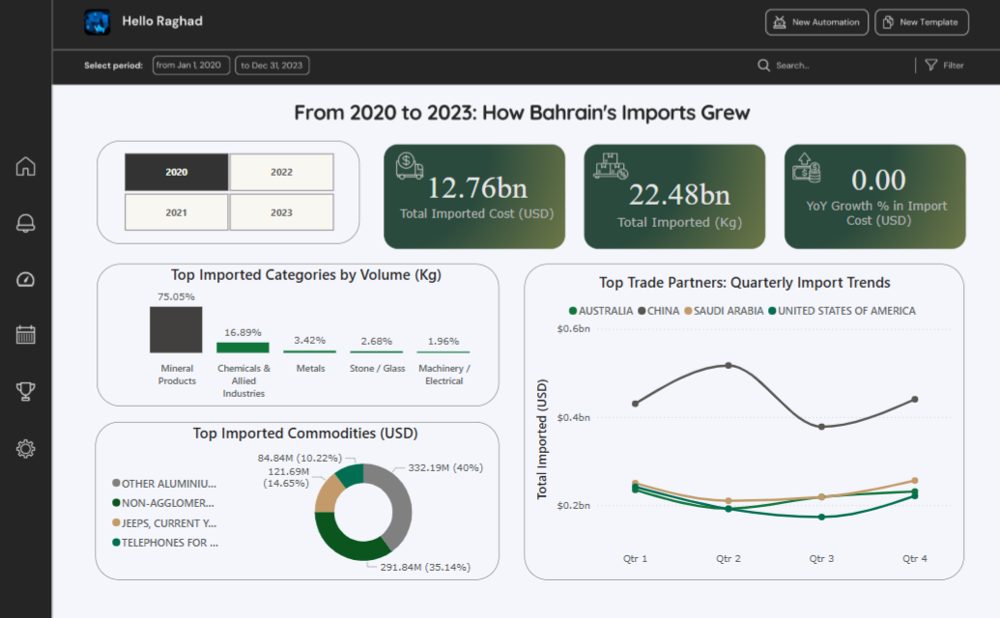

# 📊 A Power BI Dashboard Analyzing Bahrain & Brazil’s Import Trends (2020–2023) 🚢🧭  

## Overview  
This repository contains Power BI dashboards that provide insights into **Bahrain** and **Brazil's** import trends from 2020 to 2023. These dashboards visualize key trade patterns, top commodities, and major importing countries.  

## 📂 Data Source & Cleaning  
- Bahrain’s data was sourced from: [Data.gov.bh](https://www.data.gov.bh/explore/?disjunctive.theme&sort=modified&q=import)  
- Brazil’s data was obtained from official trade sources.  
- Data from **2020-2023** was compiled, cleaned, and analyzed for meaningful insights.  

## 📊 Key Insights  
### Bahrain’s Imports  
1. 📈 **Total Import Growth** – Year-over-year analysis  
2. 🌎 **Top Importing Countries** – Quarterly trends & trade partners  
3. 🏗 **Key Imported Commodities & Categories**  
4. 💰 **Import Value & Weight Breakdown**  

### Brazil’s Imports  
1. 📉 **Fluctuating Import Costs** – Yearly trends and YoY growth analysis  
2. ⛏ **Dominance of Mineral Products** – Over 90% of total import weight  
3. 🏭 **Major Commodities** – Meat, aluminum, and petroleum coke  
4. 📆 **Quarterly Import Trends** – Trade variations across the year  

## 📊 Dashboards  
### **Bahrain Imports Shares**  
  

### **Brazil Imports Shares**  
  

## 📝 Summary  
1. **Bahrain**: Total import cost (USD) has been increasing, with fluctuations in YoY growth.  
2. **Brazil**: Heavy reliance on mineral products, with significant shifts in import cost over the years.  
3. **Common Trends**: Trade partner variations and shifts in import volumes indicate changing market dynamics.  
